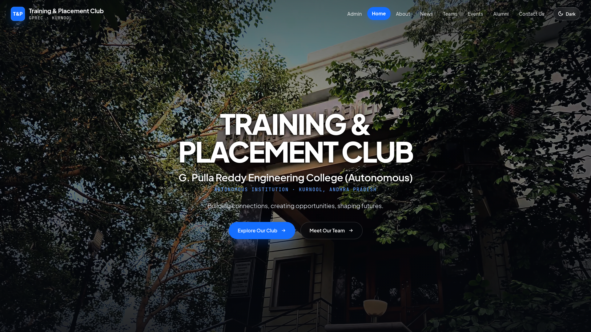
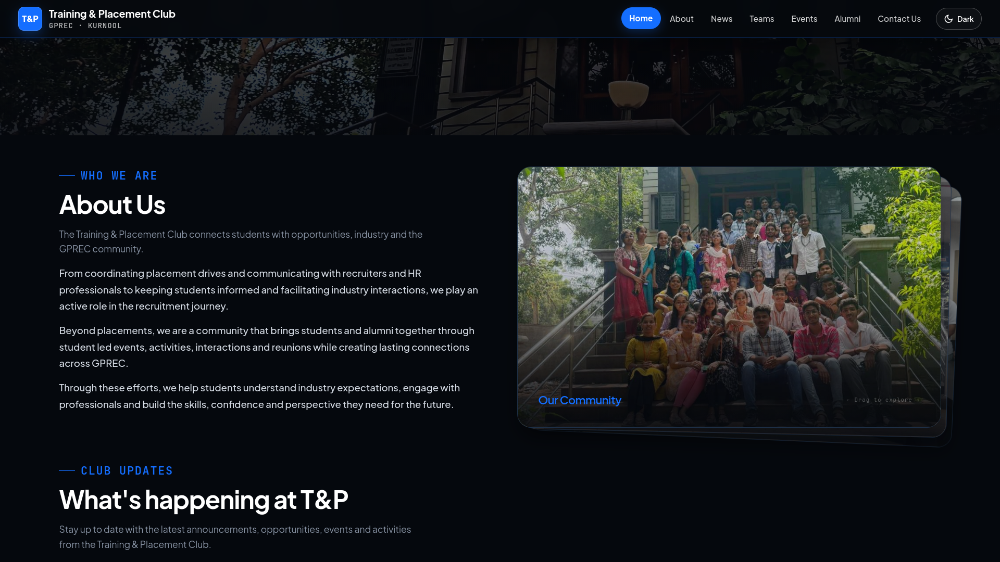
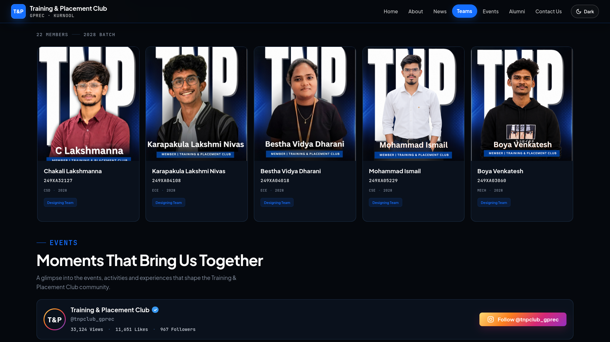
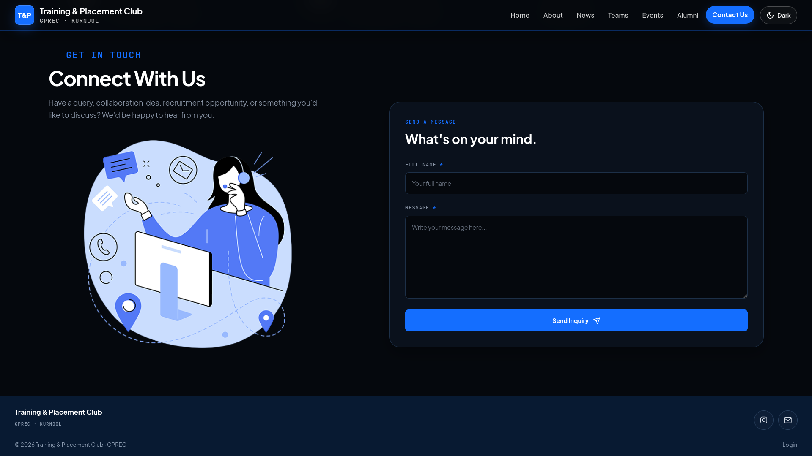
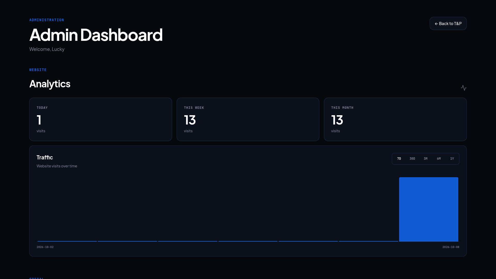
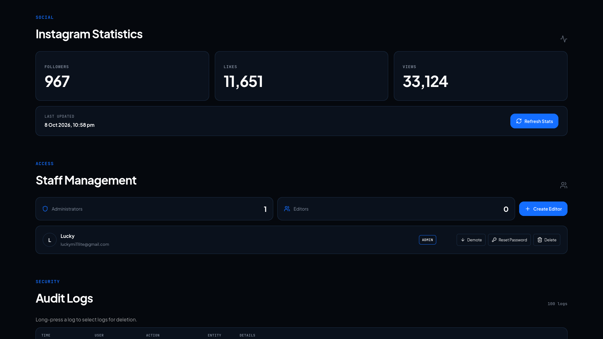
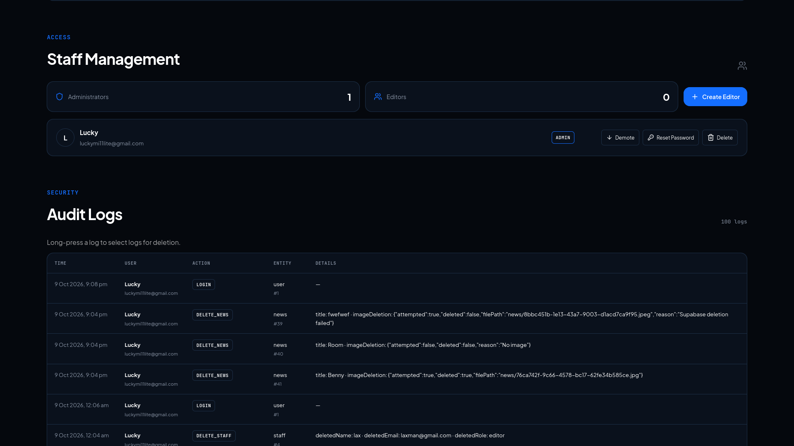
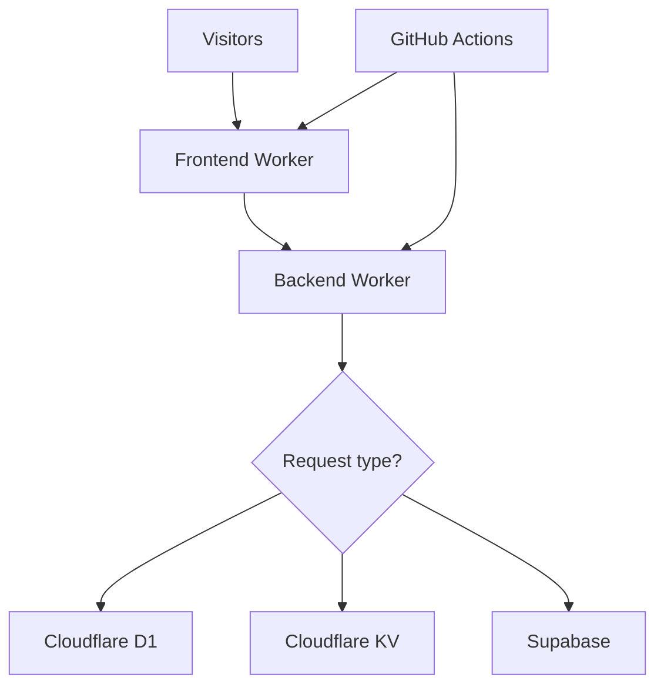

# T&P | GPREC

The official website for the **Training & Placement Club** at **G. Pulla Reddy Engineering College (Autonomous), Kurnool**.

The website brings together club information, team details, events, news and contact information in one place.

**Live website:** https://tnp-website.tnpwebsite2026.workers.dev/

## Website Preview

| Home | About and News |
|---|---|
|  |  |
| Teams and Events | Contact |
|  |  |

## Admin Dashboard

| Views and Analytics | Instagram Statistics | Staff Management and Audit Logs |
|---|---|---|
|  |  |  |


## 🛠️ Tech Stack

- **Frontend:** React, Vite, CSS
- **Backend:** Cloudflare Workers
- **Database:** Cloudflare D1
- **Key-value storage:** Cloudflare Workers KV
- **Image storage:** Supabase Storage for dynamically uploaded news images
- **Deployment:** Cloudflare Workers and GitHub Actions

## 🏗️ Architecture




### Request Flow

1. **Frontend:** Cloudflare serves the React application and its static assets.
2. **API routing:** Requests to `/api/*` are forwarded to the backend through the `API` service binding.
3. **Backend:** The backend Worker processes API requests, authentication, news operations, and administrative functionality.
4. **Database:** Cloudflare D1 stores structured application records, including news data and image references.
5. **Statistics:** Workers KV stores Instagram statistics.
6. **Images:** Supabase Storage holds dynamically uploaded news images.
7. **Deployment:** GitHub Actions runs configured checks and deployment workflows.

## 🚀 Local Development

### Prerequisites

- Bun
- Git
- A Cloudflare account for backend development and deployment
- Required local environment variables for the backend

### 1. Clone the repository

```bash
git clone https://github.com/tnp-website/tnp-website.git
cd tnp-website
```

### 2. Start the frontend

```bash
cd frontend
bun install
bun run dev
```

Vite prints the local development URL in the terminal.

### 3. Start the backend

Open another terminal:

```bash
cd backend
bun install
bun --watch src/workers/worker.js
```

Configure the required local environment variables and bindings before testing API functionality. Refer to the Wrangler configuration and backend code for the required settings.

## 🔐 Security & Configuration

- Keep secrets in local environment files or Cloudflare Worker secrets.
- Do not expose credentials in frontend code or commit them to Git.
- Configure GitHub Actions secrets for automated Cloudflare deployments.
- Keep database bindings, service bindings, and environment configuration consistent with the Wrangler files.
